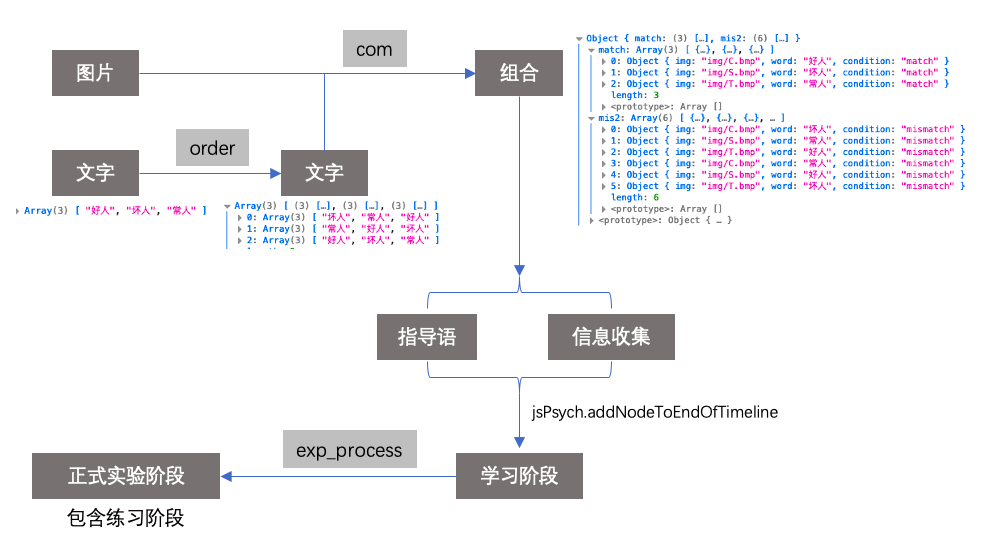

# jspsych本身

`jsPsych v6.3.0` > [github](https://github.com/jspsych/jsPsych)
## 环境问题
理论上全浏览器支持（除了IE浏览器）

支持协议：`file://`, `http://`, `https://`

## 文件结构
```shell
.
├── README.md
├── assets----------------资源存放
│   ├── js----------------JS部分文件
│   ├── jspsych----------------jsPsych 主体位置
│   └── psychophysics----------------jspsych psychophysics所处位置
└── exp----------------实验程序所处位置
    ├── css.js----------------样式文件
    ├── exp.js----------------定义实验流程
    ├── img----------------图片存放位置
    ├── index.css----------------样式文件
    ├── index.html----------------核心文件，如需使用，请在浏览器打开这个文件
    ├── info.js----------------收集信息，被试的信息
    ├── jspsych.css----------------jspsych样式文件
    ├── jspsych.js----------------修改过一些的jspsych主体文件
    └── utils.js----------------工具箱
```

## 实验运行步骤



首先，利用自定义`order`函数将文字，即人物标签打乱成每行每列不相等的情况，再利用自定义`com`函数将图片和文字进行组合，分为匹配和不匹配两种条件。
另外，正式阶段由`exp_process`函数自动生成，包含练习过程。
> 注：最终时间变量所涵盖的所有条件当中，匹配和不匹配数量是一致的，即上图中，尽管匹配数量有3个，不匹配数量有6个，但是时间线当中匹配数量有6个，同不匹配数量。


