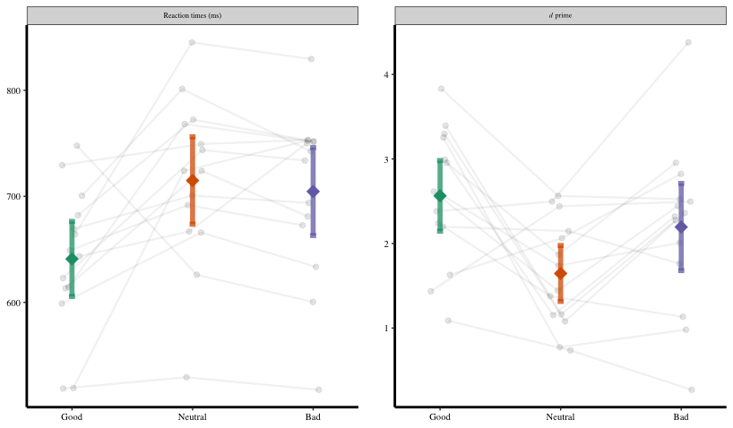
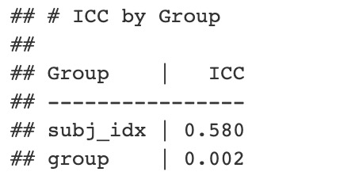

# Social associative learning task (Online)

本Repo旨在开发一个基于[Sui et al. (2012). JEP:HPP](http://www.ncbi.nlm.nih.gov/pubmed/22963229).等的社会联结学习任务 (SALT) 的在线实验程序模板，实验程序通过开源工具 [jsPsych](https://www.jspsych.org/) 和 [psychophysics插件](https://jspsychophysics.hes.kyushu-u.ac.jp/) 来实现。

为了验证该程序的有效性，我们使用在线方式重复了[胡传鹏博士论文](http://www.chinaxiv.org/abs/201909.00137)中的第一个实验。该实验使用道德人物作为社会联结学习的标签（好人、常人和坏人）。以下是实验室原始实验与使用当前程序的在线实验之间的比较。

[>>实验程序<<](Procedure/README.md) | [>>详细结果<<](result/README.md)
## 实验参数

实验室实验:

    实验设计: 2 (匹配 vs 不匹配) * 3 (道德效价: 好人, 常人, 坏人)
    
    实验试次: 60/condition
    
    被试: 35

在线实验:

    实验设计: 2 (匹配 vs 不匹配) * 3 (道德效价: 好人, 常人, 坏人)
    
    实验试次: 72/condition
    
    被试: 20

## 结果

### jsPsych第一次实验和实验室实验


### jsPsych实验重测结果



第一次在线实验后四周对被试进行重测，收集到有效数据14份，对jsPsych收集到的所有数据根据首次测试和重测进行分类并计算Intra-Class Correlation (ICC)值:

```R
#rt的icc值
library(performance)
icc1 <- icc(m1, by_group = T)
icc1
```



```
#dprime的icc
m2 <- lmer(dPrime ~ valence + (1 | group) + (1 | subj_idx), data = df.dprime)
dprime.icc1 <- icc(m2, by_group = T)
dprime.icc1
```


结果表明，被试在两次实验中的结果具有较高的相似性，有较好的信度。
