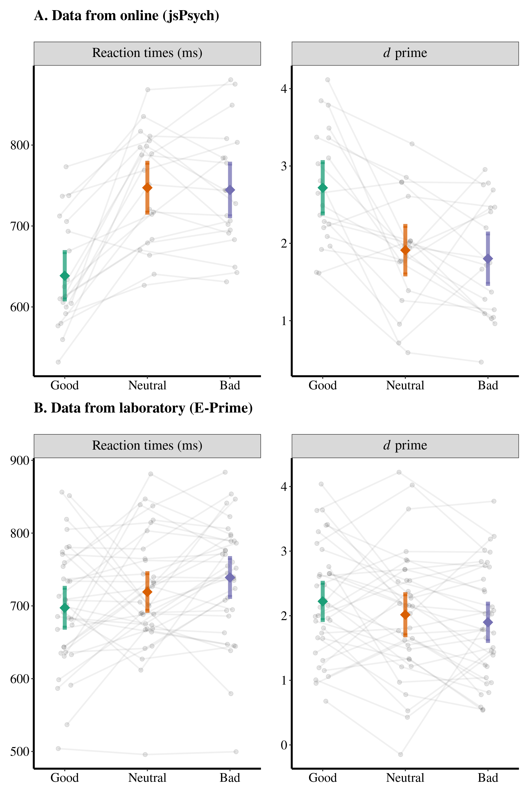

# Social associative learning task (Online)

This repo aimed at developing an online experimental procedure of social associative learning task (SALT), which was based on [Sui et al. (2012). JEP:HPP](http://www.ncbi.nlm.nih.gov/pubmed/22963229). We used open source toolbox [jsPsych](https://www.jspsych.org/) and [psychophysics plugin](https://jspsychophysics.hes.kyushu-u.ac.jp/) to program the procedure.

As a validation of the procedure, we replicated one study from Hu Chuan-Peng's PhD thesis, which used moral valence as the label (good person, neutral person, and bad person) for social associative learning. Below are the comparison between original experiment in lab and online experiment using the current procedure.

## Experimental parameters

Lab experiment:

    Design: 2 (match vs nonmatch) * 3 (moral valence: good, neutral, bad)
    
    Number of trials: 60/condition
    
    Participants: 35

Online experiment:

    Design: 2 (match vs nonmatch) * 3 (moral valence: good, neutral, bad)
    
    Number of trials: 72/condition
    
    Participants: 20

## Results
